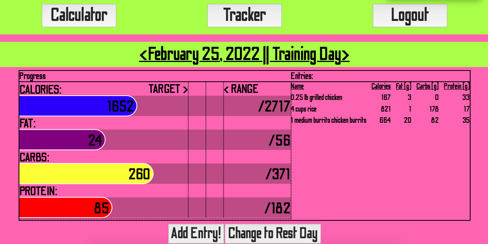

# M A C R O _ T R A C K E R
### Macro Tracker, a PDX Code Guild Full Stack Capstone Project

This app was designed as a final capstone project for the PDX Code Guild Full Stack Web Developer Bootcamp.  It is a macro tracking app, which calculates a user's required macronutrients for fitness goals and allows the user to track their nutrition daily.  The app was built using Django and Vue.js and features hand-crafted canvas bar graphs.

### Check out Macro Tracker [here](https://pjz987.pythonanywhere.com)



## Instructions to Run App Locally

Activate a virtual environment, or just pip install globally.
```
$ pip install -r requirement.txt
$ py manage.py migrate
$ py manage.py runserver
```

Click "Get Started" to create an account.